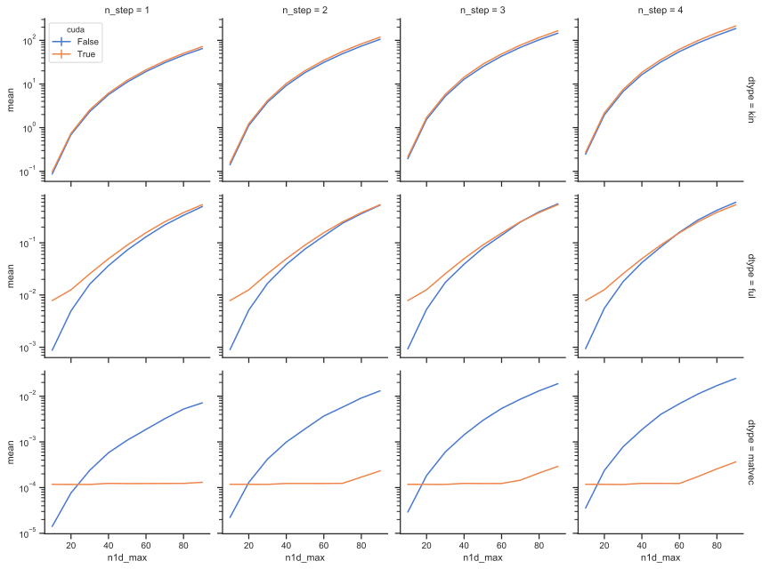

# Benchmark of CUDA vs ARPACK

Comparison of `cupy.sparse` vs `scipy.sparse` allocation and application of lattice Hamiltonian.

## Details

I allocate a lattice Hamiltonian in three spatial dimensions with `n1d_max` lattice points in each dimension (`volume = n1d_max**3`).
The Laplace derivative is implemented with `n_steps` in each direction.
For example, in the case of `n_step = 1`, the derivative connects `f(x + ϵ)`, `f(x)` and  `f(x - ϵ)`.

The benchmark compares pure `scipy` code to mixed `scipy`/`cupy` code.

`dtype` | `scipy` | `cupy`
---|---|---
`kin` | Kinetic Hamiltonian is allocated in `scipy` | Kinetic Hamiltonian is allocated in `scipy` and copied to `cupy`
`ful` | Interaction is allocated in `scipy` and added to kinetic Hamiltonian | Interaction is allocated in `cupy` and added to kinetic Hamiltonian
`matvec` | Full Hamiltonian is applied to `scipy` vector | Full Hamiltonian is applied to `cupy` vector

When benchmarking interactions, the kinetic Hamiltonian is allocated once, the full Hamiltonian is allocated each time one changes the interactions (each fitter iteration) and the `matvec` operation is applied multiple times depending on the fitter routine.

## Result

## Conclusion
* Apparently `matvec` has a fixed startup time and only after more than `n1d_max = 60`, we actually see a size dependence. This means there is no need to look at systems with `n1d_max < 60` for `matvec` only.
* For this benchmark, starting at `n1d_max = 22`, `cupy` dominates `scipy`.

## Open questions

* Can one speed up allocation of full Hamiltonian even further? Unfortunately the `cupy.sparse` interface does not allow setting of individual components after matrix allocation (is this really true)? Maybe partial scipy allocation plus transfer to GPU is faster?
* Is the `matvec` fixed starting time might be set up time. There might be even more speed up when doing multiple `matvec` iterations.
